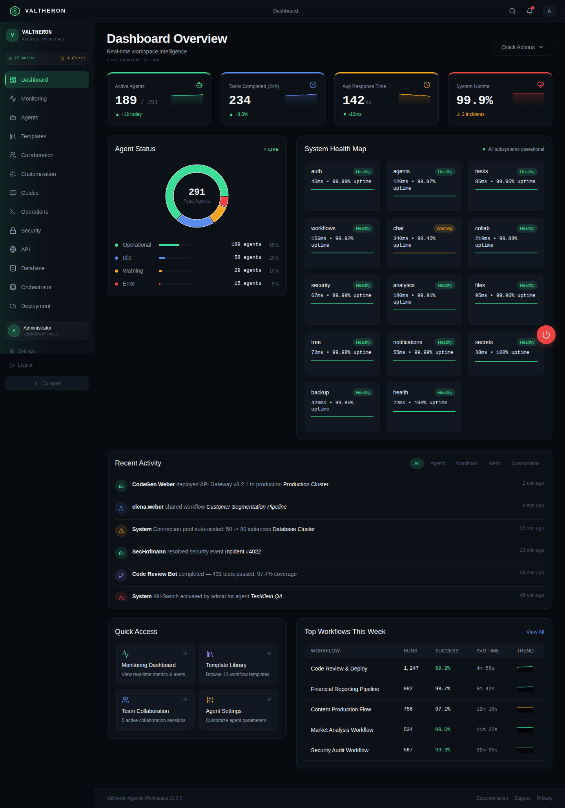

# Valtheron Agentic Workspace

Agentic-Workspace-Plattform mit 291 vorkonfigurierten KI-Agenten in 16 Kategorien —
Dashboard, Dokumentation und Architektur in einem Repository.

**🌐 Live-Dashboard:** https://valtheron.github.io/Valtheron_valtheron-agentic-workspace/
(wird bei jedem Push automatisch per GitHub Actions gebaut und deployed)



## Schnellstart

```bash
# Dashboard lokal entwickeln (React 19 + TypeScript + Vite)
cd dashboard
npm install
npm run dev        # → http://localhost:5173

# Backend mit echten Agenten starten (Express + SQLite + Anthropic API)
cd server
npm install && cp .env.example .env   # ANTHROPIC_API_KEY eintragen
npm run seed && npm start             # → http://localhost:3001

# Oder: fertig gebaute Demo ohne Node.js starten
cd dashboard-demo
python3 -m http.server 8080   # → http://localhost:8080/#/
```

## Repository-Struktur

| Verzeichnis | Inhalt |
|---|---|
| [`dashboard/`](dashboard/) | **Quellcode** des Dashboards — React 19, TypeScript, Vite 7, Tailwind, shadcn/ui, 14 Views inkl. Agent Console |
| [`server/`](server/) | **Backend** — Express 5, SQLite (291 Agenten), Anthropic API: Agenten führen echte Tasks aus (SSE-Streaming) |
| [`dashboard-demo/`](dashboard-demo/) | Fertig gebaute Offline-Demo (statisch, ohne Build-Tools lauffähig) |
| [`guides/`](guides/) | Das „Kochbuch": Handbuch v2.0 (PDF), Master-Anleitung, Konzept, Personas-Analyse, User/Admin/Developer Guides |
| [`architecture/`](architecture/) | Agent-Orchestrator und Security-Modell (Kill-Switch, Audit-Trail) |
| [`api/`](api/) | Express-API-Endpunkte |
| [`deployment/`](deployment/) | Kubernetes/Helm-Deployment |
| [`onboarding/`](onboarding/) | Contributor-Blueprint |
| [`roadmap/`](roadmap/) | v2 Database-Scaling |

## Das Dashboard

14 Views: Dashboard Overview, Monitoring, Agents (Katalog mit 291 Agenten),
**Console** (echte Agenten-Tasks über das Backend, live gestreamt), Templates,
Collaboration, Customization, Guides, Operations, Security, API, Database,
Orchestrator, Deployment.

Die Mock-Daten stammen aus dem [Valtheron Handbuch v2.0](guides/Valtheron_Handbuch_v2.pdf):
16 Agenten-Kategorien, 8 Archetypen, 12 Persönlichkeitsparameter, 6 Zertifizierungs-Level,
3 Workflow-Typen und 5 Collaboration-Patterns.

## Deployment des Dashboards

Der Workflow [`.github/workflows/deploy-pages.yml`](.github/workflows/deploy-pages.yml)
baut `dashboard/` bei jedem Push auf den Default-Branch und veröffentlicht das
Ergebnis auf GitHub Pages. Manuell auslösbar über den „Actions"-Tab
(*Deploy dashboard to GitHub Pages → Run workflow*).

---

**Eigentümer:** BlackIceSecure & blackiceguard.io / Valtheron ·
**Version:** v1.0.0 Genesis Release
